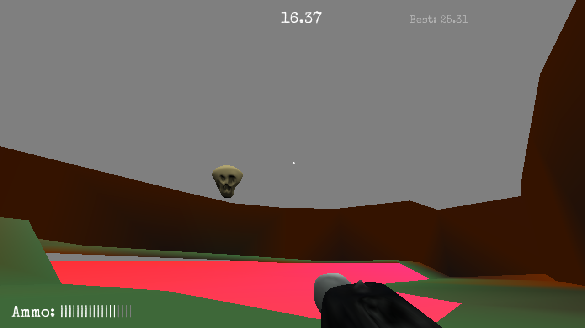

# Skull Shooter

Author: Scott King, William Ozeas  
Design: Skull shooter is about shooting skulls! And not dying! So shoot skulls and don't die!

Screen Shot:

How To Play:
- Move: wasd
- Shoot: Left mouse button
- Reload: r

Sources:
- Special Elite Font: https://fonts.google.com/specimen/Special+Elite?category=Display&sort=popularity (OFL)
- Gunshot sound effect: https://freesound.org/people/okieactor/sounds/415912/ (CC0)

This game was built with [NEST](NEST.md) and was forked from: https://github.com/15-466/15-466-f22-base5

